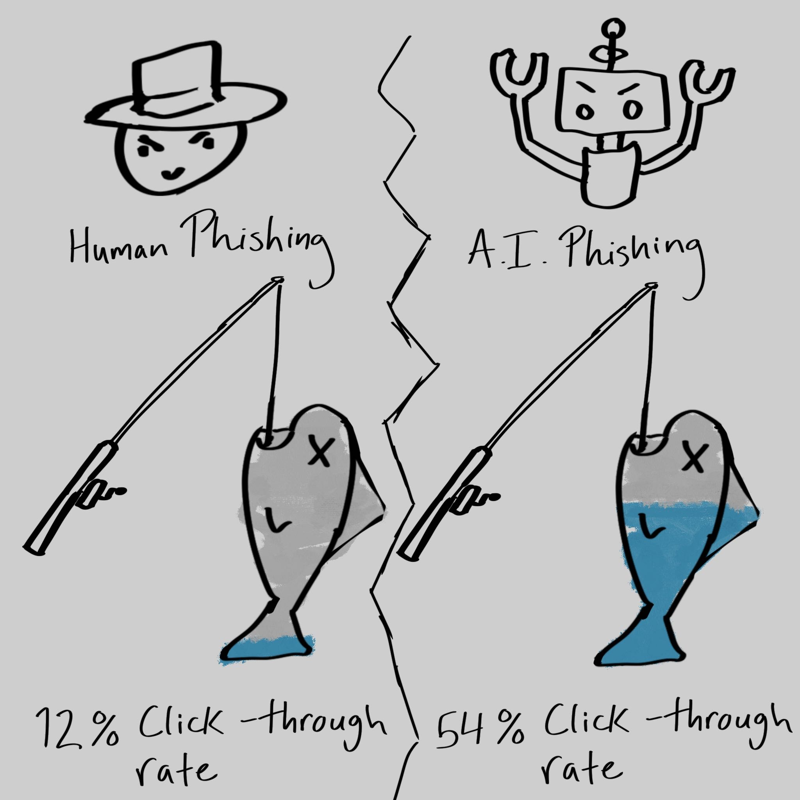

In this podcast, Hero Czarnik and I (Damien Jackson) discuss using AI's utility in scams, and how it's *really* convincing when it's lying. 

According to a 2025 report, AI-based phishing scams have a much larger click-through rate than human phishing scams:
